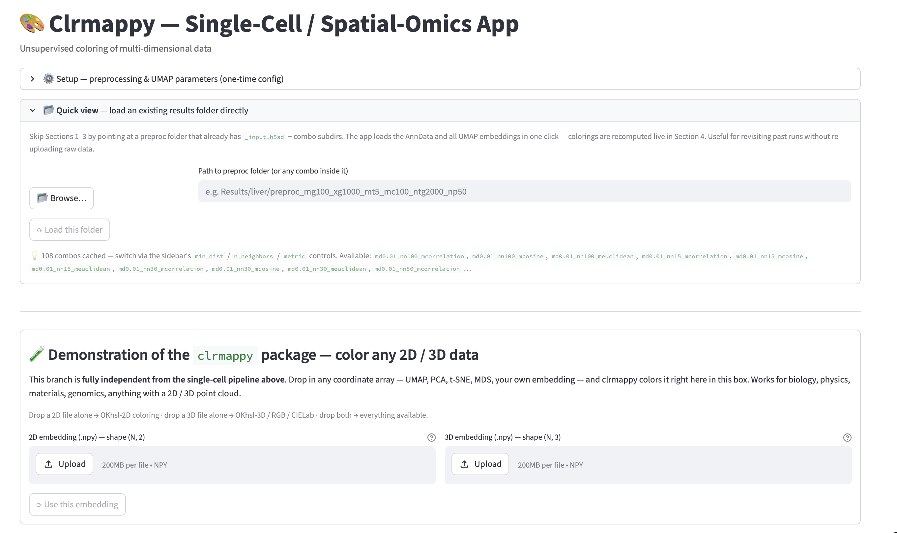
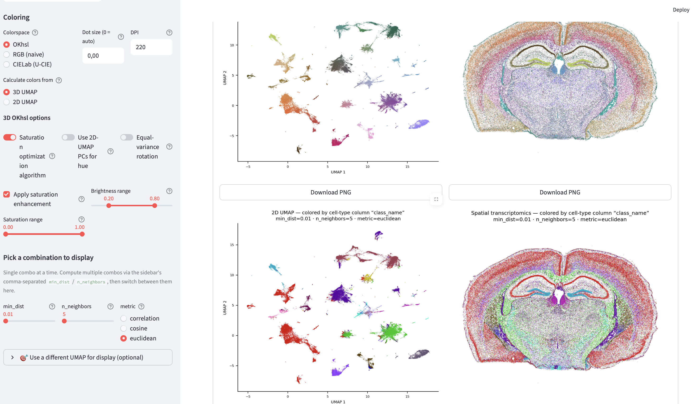

# clrmappy — Unsupervised Coloring of 2D/3D Embeddings of Multi-Dimensional Data

Python package and interactive streamlit app for **unsupervised coloring** of 2D / 3D embeddings (UMAP, PCA, t-SNE, …). It includes scanpy/anndata based preprocessing and umap-computing functions for a single cell pipeline, but 2D/3D arrays can be used directly as well.

The package currently includes three color spaces:

- **OKhsl** (based on Björn Ottosson's perceptually-uniform OKlab, cylindrical color space) — 2D- or 3D-based
- **RGB naive** — simple RGB coloring (cubic color space)
- **CIELab** via the R package (complex shaped sRGB gamut)
  [`ucie`](https://github.com/mikelkou/ucie) (Koutrouli et al.)

---

## Installation


### Option A — full dev environment with conda (recommended)

This is the path the demo notebook + the Streamlit app are tested with.
Get everything (Python, scanpy, Streamlit, the package itself) in one go:

```bash
# 1. Clone the repo into a folder of your choice
git clone https://github.com/HiDiHlabs/clrmappy.git
cd clrmappy

# 2. Create the conda env from the yaml file (one-time, ~3–5 minutes)
conda env create -f clrmapenv.yaml

# 3. Activate it (every new terminal session)
conda activate clrmapenv
```

The last line of `clrmapenv.yaml` runs `pip install -e .` inside the env,
which installs `clrmappy` itself in **editable** mode — meaning Python
finds the package no matter which folder you're working from (notebooks,
scripts, anywhere). Test it:

```bash
python -c "import clrmappy as cm; print(cm.__all__)"
```

You should see a list of 12 public symbols like `emb_to_okhsl`,
`plot_emb_2d`, etc.

### Option B — pip only, no conda

If you already have a Python ≥3.10 environment you want to reuse:

```bash
# Clone and install in editable mode
git clone https://github.com/HiDiHlabs/clrmappy.git
cd clrmappy
pip install -e .

# For the Streamlit app additionally:
pip install -e ".[app]"
```

Or install directly from GitHub without cloning (works for the library API,
NOT for running the Streamlit app or notebooks from the repo):
```bash
pip install git+https://github.com/HiDiHlabs/clrmappy.git
```

---

### Optional: CIELab support

`cm.emb_to_cielab` calls the R package
[`mikelkou/ucie`](https://github.com/mikelkou/ucie) via a subprocess.
On macOS this also requires **XQuartz**:

```bash
brew install --cask xquartz
```

After install, log out / restart once so XQuartz registers. The R `ucie`
package is auto-installed on the first call.

---

## Verify the install (sanity check)

After Option A or B, run this from anywhere:

```bash
python -c "
import clrmappy as cm
import numpy as np
rgb = cm.emb_to_okhsl(emb_3d=np.random.randn(50, 3))['clrmappy']
print('clrmappy works — rgb shape:', rgb.shape)
"
```

Expected output: `clrmappy works — rgb shape: (50, 3)`.

If you instead see `ModuleNotFoundError: No module named 'clrmappy'`,
your env isn't activated or `pip install -e .` didn't run — go back to
the install step.

---

## Single Cell Demo Notebook

The `demo-notebooks.ipynb` folder has a minimal end-to-end examples showing the API:

The notebook loada a `.h5ad`, color the embeddings, and render every
plot type via the `cm.plot_*` functions.

## Input Data for Single Cell Analysis 
- **Use your own `.h5ad`** — any AnnData with cells × genes works. The
  Streamlit app's drag-and-drop accepts it; for the demo notebooks use


---

## Python API — `clrmappy` package

```python
import clrmappy as cm

# 1. (Optional) preprocess single-cell / spatial-omics data
adata = cm.preprocess(
    adata,
    min_genes=20, max_genes=200, min_cells=100,
    mt_cutoff=5, n_top_genes=2000,
)

# 2. (Optional) compute 2D + 3D UMAPs
res = cm.compute_umaps(
    adata,
    min_dist_2d=0.1, min_dist_3d=0.1,
    n_neighbors_2d=30, n_neighbors_3d=30,
    metric_2d='euclidean', metric_3d='euclidean',
)
emb_2d, emb_3d = res['umap_2d'], res['umap_3d']

# 3a. OKhsl coloring
res = cm.emb_to_okhsl(
    emb_3d=emb_3d, emb_2d=emb_2d,
    iso_rot_scale=True,
    equal_variance_mode=False,
    pc1_and_2_from_2d=False,
    brightness_range=[0.2, 0.8],
    saturation_enhancement=True,
    saturation_range=[0.1, 1.0],
    center_around='mid',
)
rgb = res['clrmappy']
emb_fit = res['emb_fit']

# 3b. RGB naive
res = cm.emb_to_rgb(emb_3d, equal_variance_mode=False)
rgb = res['clrmappy']

# 3c. CIELab (requires R + ucie package + XQuartz on macOS)
rgb = cm.emb_to_cielab(embedding=emb_3d)
```

### Plot functions (notebook-friendly)

Same plots as the Streamlit app, exposed for direct notebook use.

```python
cm.plot_emb_2d(emb_2d, color=rgb, title='2D UMAP — my run')
cm.plot_emb_3d(emb_3d, color=rgb)             # interactive, rotatable
cm.plot_spatial(adata, color=rgb)
cm.plot_emb_2d_vs_celltype(adata, rgb, 'class_name')
cm.plot_spatial_vs_celltype(adata, rgb, 'class_name')
cm.plot_okhsl_fit(emb_fit, color=rgb)         # 2D or 3D, auto-detected

# Works with non-UMAP embeddings too:
cm.plot_emb_2d(adata, color=rgb, obsm_key='X_pca',
               dim_labels=('PC1', 'PC2'),
               title='PCA — OKhsl')
```

Conventions:
- `color` accepts `(N, 3)` RGB floats in `[0, 1]` OR a list of `#rrggbb`
  hex strings (auto-converted)
- Spatial plots use `aspect="equal", adjustable="datalim"` — data is
  padded symmetrically, axes box stays fixed
- Every plot function accepts `show=False` to return the Figure object
  for further manipulation / saving

### Annotation loading helper

```python
labels = cm.load_csv_annotations(
    'liver_annotations.csv', adata,
    ann_col='subcluster',
    replace_map={'Hepatocyte_1': 'Hepa 1_3',
                 'Hepatocyte_2': 'Hepa 1_3'},
)
cm.plot_spatial_vs_celltype(adata, rgb, labels)
```

---

## How the OKhsl algorithm works

1. **PCA** on the 3D embedding (or 2D for `base='2d'`) + centering
   (`mid` or `mean`)
2. **(Optional) saturation-optimization algorithm** (`iso_rot_scale=True`):
   searches for the rotation around the y-axis that maximises `r_z`
   (radial distance from the brightness axis) without distorting the
   z-range. Trades unused brightness headroom for extra saturation. This
   minimises the distortion that *active* saturation enhancement would
   otherwise introduce.
3. **(Optional) saturation enhancement**: rescales `r_z` to the requested
   range `[s_min, s_max]` via min-max
4. **OKhsl conversion**: h = `arctan2(y, x)`, s = `r_z`, l = `z` → sRGB

The fitted embedding is returned as `emb_fit` and can be
inspected — useful for gauging how strongly the algorithm
deformed the cloud.

---

## Repository layout

```
clrmappy/
├── app.py                              — Streamlit explorer app
├── compute_core.py                     — shared compute logic (app + batch)
├── compute_batch.py                    — headless overnight runs
├── __init__.py                         — package entry point (public API)
├── clrmap_main.py                      — emb_to_rgb / emb_to_okhsl / emb_to_cielab
├── _okhsl_utils.py                     — internal OKhsl helpers
├── _plotting.py                        — plot functions (notebook + app)
├── single_cell_helper_functions.py     — preprocess + compute_umaps
├── pyproject.toml                      — pip-installable metadata
├── clrmapenv.yaml                      — reproducible conda dev env
├── LICENSE                             — MIT
└── README.md                           — this file
```

---

## Common Issues

- **`adata.copy()` per UMAP combo** can be RAM-hungry on very large
  datasets. If that becomes a problem → switch to in-place PCA + UMAP.
- **CIELab needs R + XQuartz** on macOS. If XQuartz is missing, the first
  call to `cm.emb_to_cielab` fails with an R error about the `X11`
  library. Install via `brew install --cask xquartz`, then restart once.

---

## Running the Streamlit app

```bash
conda activate clrmapenv
# From the repository root (the folder containing pyproject.toml):
streamlit run app.py
```

Opens automatically in the browser at `http://localhost:8501`.

---

## Three ways to get colors

The app offers three independent entry paths:

### A) Full single-cell pipeline (Sections 1–4)
1. **Drag & drop a `.h5ad`** file
2. **Preprocess + PCA** (or skip if `X_pca` is already present)
3. **Compute UMAPs** for every `min_dist × n_neighbors × metric` combination
4. **Explore** with live-recomputed colorings via the sidebar controls

### B) Quick view — load an existing results folder
- Point at a preproc folder (e.g. `Results/liver/preproc_mg100_xg1000_…`)
  via a **text path** or the **📂 Browse button** (native macOS Finder)
- The app loads `_input.h5ad` + every `emb2d.npy / emb3d.npy` pair
- The sidebar is automatically restored from the folder's `setup.json`
- Jumps straight to Section 4

### C) Quick UMAP upload — bare embedding files
- Upload any `.npy` 2D and/or 3D embedding (UMAP, PCA, t-SNE, …)
- No raw data needed — no spatial / cell-type panels in this mode
- Self-contained "demonstration" box: color picker + plots all inline,
  fully independent from the main pipeline

---

## Setup expander — one-time parameters

Collapsible block at the top of the page. You only touch it once before
running computations.

| Section | Fields | Notes |
|---|---|---|
| **Preprocessing** | `min_genes`, `max_genes`, `mt_cutoff`, `min_cells`, `n_top_genes` | classic scanpy QC + HVG selection |
| | `Skip (data already preprocessed)` | enable when `X_pca` / `scaled` layer is already present |
| **UMAP** | `n_pcs` | number of PCA components (default 50) |
| | `center_around` | `mid` (default) or `mean` — OKhsl-PCA centering mode |
| | `min_dist (list separated by comma)` | e.g. `0.01, 0.1, 0.3` — Compute runs all values |
| | `n_neighbors (list separated by comma)` | e.g. `15, 30, 50` |
| | Metric checkboxes | `euclidean` / `cosine` / `correlation` (multi-select) |
| **Output directory** | path with `?` as placeholder | **Compute / Load buttons stay disabled until `?` is replaced** |

In Quick-View mode, the setup expander is auto-populated from the loaded
folder's `setup.json` — you don't need to touch it manually.

---

## Section 4 — Explore



All the interactive controls live in the **left sidebar** so you can adjust
them without scrolling away from the plots:

### Per-mode parameters

**OKhsl**
- `Calculate colors from`: 3D or 2D base
- *3D base only:*
  - `Saturation optimization algorithm` (= `iso_rot_scale`) — rotates the
    PCA so the saturation (radial distance `r_z`) is maximised
    **without distortion**. Default ON.
  - `Use 2D-Embedding PCs for hue` (= `pc1_and_2_from_2d`) — hue from the 2D
    embedding's PCs instead of the 3D PCs
  - `Equal-variance rotation` (= `equal_variance_mode`) — fixed 45°
    rotation around all three axes for balanced channel variance
- `Apply saturation enhancement` (checkbox) — when OFF, `r_z` is used raw
  (the saturation slider below is disabled)
- `Saturation range` (slider min/max, default `[0.1, 1.0]`) — `r_z` is
  rescaled into this range
- `Brightness range` (slider min/max, default `[0.2, 0.8]`) — z →
  Lightness mapping. With OKhsl-2D, brightness is constant at the mid
  of the range.

**RGB (naive)**
- `Equal-variance rotation` toggle — otherwise direct min-max scaling

**CIELab (U-CIE)**
- No tunable parameters — `ucie` handles everything internally

### Live recompute

Every slider / toggle triggers an immediate recompute via
`cm.emb_to_okhsl` / `cm.emb_to_rgb` / `cm.emb_to_cielab`. Nothing is
auto-cached — color computation is cheap enough that re-deriving it is
faster than disk IO.

### "💾 Save this coloring" button

Each rendered combo has a Save button — persists the current RGB array
as a `.npy` with a spec-encoded filename, e.g.

```
okhsl_3d_iso1_pc0_eqv0_b35-85_s40-100.npy
```

Default values (`brightness=[0.2, 0.8]`, `saturation=[0.0, 1.0]`,
saturation enhancement ON) get a short stem without suffix. Custom values
get `_b{bMin}-{bMax}_s{sMin}-{sMax}`. With saturation enhancement OFF
the suffix becomes `_noSat`.

---

## Section 3 — Compute (full pipeline only)

Clicking **Start computation** processes every `min_dist × n_neighbors ×
metric` combo:

1. 2D + 3D UMAP computed
2. `emb2d.npy` + `emb3d.npy` written into the combo subdir

Color arrays are **not auto-saved** — only via the 💾 button in Section 4.
This keeps the disk footprint small.

---

## Output directory layout

```
results/<your-name>/
├── preproc_mg20_xg200_mt5_mc100_ntg2000_np50/
│   ├── _input.h5ad           # preprocessed adata (background-job writes this)
│   ├── setup.json            # preprocessing fingerprint + params
│   ├── md0.1_nn30_meuclidean/
│   │   ├── emb2d.npy
│   │   ├── emb3d.npy
│   │   ├── okhsl_3d_iso1_pc0_eqv0.npy           # ← optional, from Save button
│   │   ├── okhsl_3d_iso1_pc0_eqv0_b35-85.npy    # ← custom brightness
│   │   └── …
│   ├── md0.01_nn15_meuclidean/
│   │   └── …
│   └── batch.log             # optional, from compute_batch.py
└── …
```

`preproc_*` subfolders are named after the preprocessing settings — runs
with identical preprocessing land in the same folder. Different
`center_around` values coexist via the OKhsl filename stem.

---

## Filename schema

### Combo folder: `md{X}_nn{Y}_m{Z}`
| Token | Meaning |
|---|---|
| `md` | UMAP min_dist |
| `nn` | UMAP n_neighbors |
| `m` | UMAP metric |

### Color file stem: `{mode}_…`

| Mode | Stem | Example |
|---|---|---|
| OKhsl 3D | `okhsl_3d_iso{0\|1}_pc{0\|1}_eqv{0\|1}` | `okhsl_3d_iso1_pc0_eqv0` |
| OKhsl 2D | `okhsl_2d` | `okhsl_2d` |
| RGB | `rgb_eqv{0\|1}` | `rgb_eqv0` |
| CIELab | `cielab` | `cielab` |

OKhsl suffixes for non-default settings:
- `_b{bMin}-{bMax}` for non-default brightness
- `_s{sMin}-{sMax}` for non-default saturation
- `_noSat` when saturation enhancement is off

→ Generated by `compute_core.color_file_stem(spec)`.

---

## Authorship

| Role | |
|---|---|
| **Ownership** | Manuel Santos Gelke, Charité — Universitätsmedizin Berlin, Freie Universität Berlin |
| **Developer** | Manuel Santos Gelke |
| **Concept**   | Naveed Ishaque, Ph.D. and Manuel Santos Gelke |

Released under the [MIT License](LICENSE).

---

## Credits

- **OKhsl** color space: Björn Ottosson —
  [bottosson.github.io/posts/colorpicker](https://bottosson.github.io/posts/colorpicker/)
- **U-CIE / CIELab gamut fitting**: Kourmpetis et al. —
  [mikelkou/ucie](https://github.com/mikelkou/ucie)
- **UMAP**: McInnes et al., via [scanpy](https://scanpy.readthedocs.io)
  / [umap-learn](https://umap-learn.readthedocs.io)
- **Glasbey palette**: for the cell-type comparison plots, via
  [`colorcet`](https://colorcet.holoviz.org)
